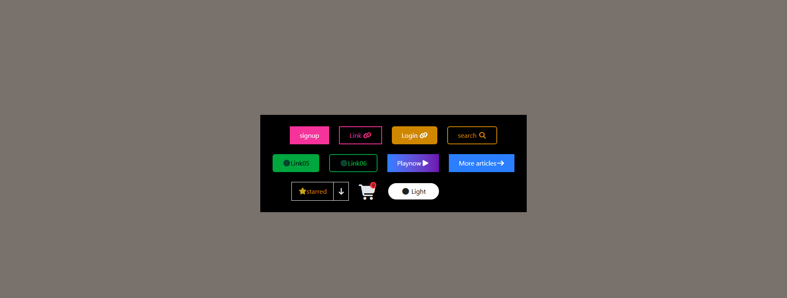

# tailwind css project 1

# Button UI Collection 🎨

This project is a simple HTML page showcasing a variety of stylish buttons built using **Tailwind CSS** and **Font Awesome icons**. It demonstrates different button styles, layouts, and hover effects that can be reused in modern web interfaces.

---

## 🚀 Features

* Multiple button styles:

  * Solid buttons
  * Outline buttons
  * Rounded buttons
  * Gradient buttons
* Icon integration using Font Awesome
* Responsive flexbox layout
* Hover effects for interactivity
* Badge and cart UI element
* Light/Dark style toggle buttons (UI only)

---

[live@]( https://aneenacg4-tech.github.io/button-CSS-Project01/)




## 🛠️ Technologies Used

* **HTML5**
* **Tailwind CSS (CDN)**
* **Font Awesome Icons (CDN)**

---

## 📁 Project Structure

```
project-folder/
│
├── index.html   # Main HTML file containing all button components
└── README.md    # Project documentation
```

---

## ⚙️ Setup & Usage

1. Clone or download this repository.
2. Open the `index.html` file in any web browser.
3. No build tools or installation required (uses CDN links).

---

## 🎯 Button Examples Included

* Signup button
* Login button
* Search button
* Link buttons with icons
* Gradient "Play Now" button
* Cart icon with notification badge
* Starred dropdown-style button
* Light/Dark theme buttons (UI only)

---

## 📸 Preview

The layout centers a container with multiple buttons arranged using flexbox. Buttons adapt spacing and wrap automatically on smaller screens.

---

## ✨ Customization

You can easily customize:

* Colors using Tailwind classes (e.g., `bg-pink-500`, `text-yellow-600`)
* Border styles (`border`, `rounded-md`, `rounded-full`)
* Icons via Font Awesome classes
* Hover effects (`hover:bg-*`)

---

## 📌 Notes

* Ensure an active internet connection to load Tailwind CSS and Font Awesome from CDN.
* This project is purely frontend and does not include functionality (e.g., no JavaScript logic for toggles).

---

## 📄 License

This project is open-source and free to use for learning and personal projects.

---

## 🙌 Acknowledgements

* Tailwind CSS
* Font Awesome

---

